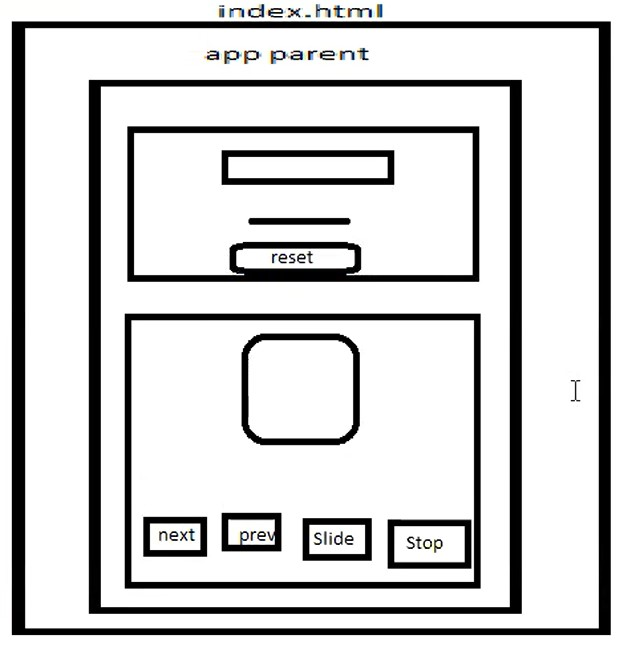
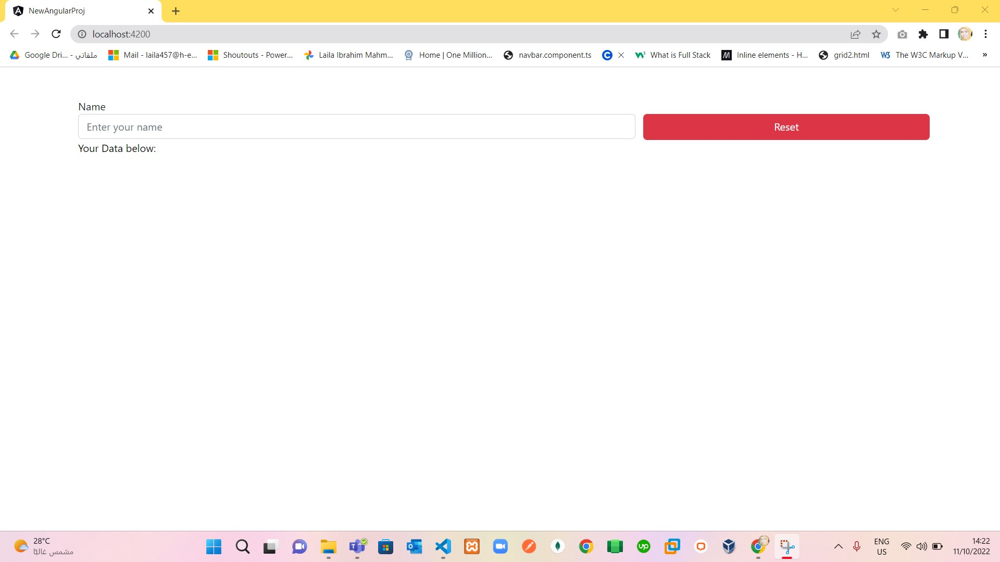
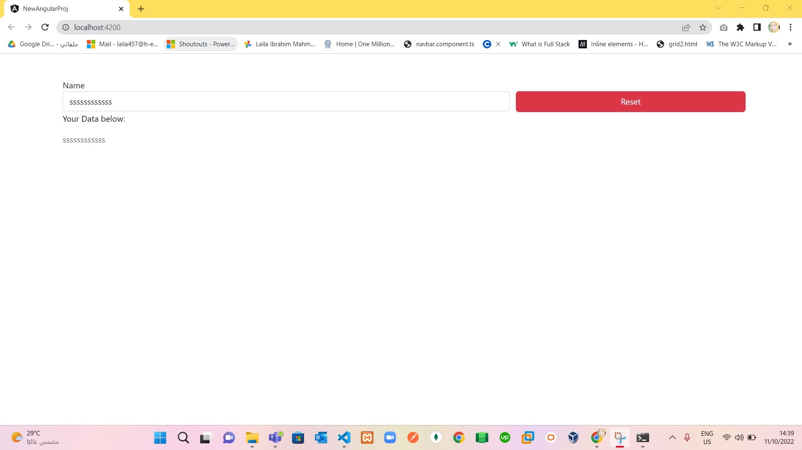
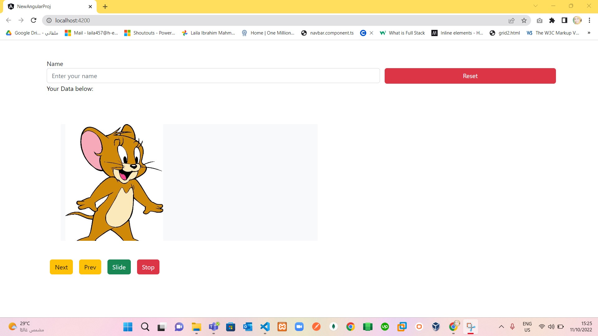

# Lab 2 Angular:

> Requirements:
 1. In project angular, create `firstComponent` Manual and `secondComponent` by angular `ng g c second`.
 2. In `firstComponent` create Input field with ngModel and two Data binding and show what you enter or remove directly below your input.
 3. In `firstComponent` add button, if clicked that will reset input field :)
 4. In `secondComponent` create `ImageSlider` with 5 images as example , create one box shown in one image only and below there are 4 buttons .
 5. In `secondComponent`, 4 buttons are one `next` to bring next image to show, one `prev` to bring previous image to show, one `slide` for slide between images every specific time as example 10 millisecond and `stop` to stop the slider.
 6. As in: 
   

> Steps:
 1. In Our Previous Project `NewAngularProj`, open terminal and run project by `ng serve -o`.
 2. add bootstrap links in `src/index.html`.
 3. Create Folder in `src/app` called `OurComponents`.
 4. Create Folder in `OurComponents` called `First`, and create 3 files in it `first.component.css`,`first.component.html`,`first.component.ts`.
 5. add input, p and button in `first.component.html`.
 6. Add FirstComponent in declarations in `app.module.ts` and import it :)
 7. open `app.component.html` and remove all default content in it and add `app-first` Tag :) 
 8. check in browser to see all is right until now :) as in:
   
 9. add name='name' attribute to input field in `first.component.html` and add [(ngModel)]="name".
 10. add {{name}} to 
 element to show any data will write or delete in the input.
 11. Add FormsModel to `app.model.ts`and import it :)
 12. check in browser as in :
   
 13. add click event with function `resetData` to reset button to empty input field.
 14. in `first.component.ts` , in `resetData` function make `name=''`.
 15. check that in browser, when I write any text in the input field, then if i click on reset button... that make input field empty :) .
 16. Now start in creating `Second` Component by run this command in terminal `ng g c Second --skip-tests` inside Mycomponents folder :) 
 17. Add 6 images in `assets/img` :) 
 18. setup the structure of `Second Component`.
 19. in app.component.html add app-second tag to make second component appear in browser as in:
  
 20. make click events on this four buttons and one way binding in that :).
 21. finish ImageSlider In `Second Component`.

